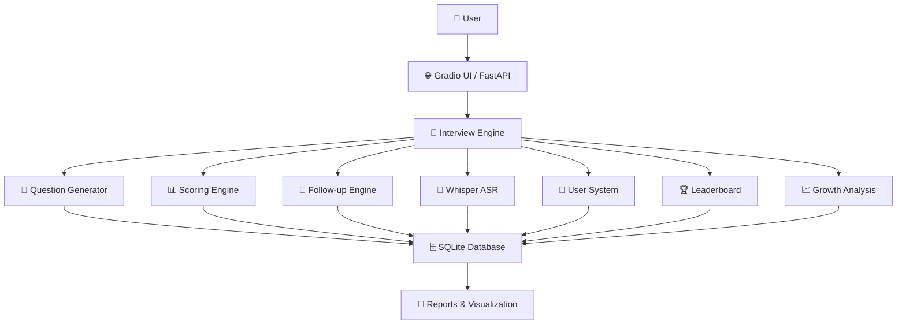

<p align="center">
  
</p>

<p align="center">
  <b>企业级 AI 面试模拟与能力成长分析平台</b><br>
  真实面试模拟 · 智能评分 · 语音识别 · 成长追踪 · 能力画像
</p>

<p align="center">
  
  
  
  
  
  
  
</p>

---

## 📊 项目看板

<p align="center">
  <table>
    <tr>
      <td align="center"><b>🤖 面试模式</b></td>
      <td align="center"><b>🧠 评分方式</b></td>
      <td align="center"><b>🎤 输入方式</b></td>
      <td align="center"><b>📈 成长追踪</b></td>
    </tr>
    <tr>
      <td align="center">动态追问 · 多岗位</td>
      <td align="center">AI 智能评分 + 维度分析</td>
      <td align="center">文字 / 语音 (Whisper)</td>
      <td align="center">趋势图 · 雷达图 · 报告</td>
    </tr>
  </table>
</p>

---

## 📖 项目简介

**SurveySpark**（曾用名 InterviewGPT）是一个基于大语言模型的智能面试平台。

> 核心理念：**让每一次面试练习都有迹可循，让每一份成长都被量化。**

它不仅能够模拟真实技术面试流程（生成题目、动态追问、智能评分），还能够**长期记录用户成长轨迹**，分析面试表现变化趋势，并生成**专业能力成长报告**。

### 🎯 适用场景
- 🎓 **求职者**：技术面试练习与能力评估
- 🏢 **企业 HR**：初筛面试自动化
- 📚 **教育机构**：学生就业能力培养
- 🧑‍💻 **开发者**：自我提升与技能复盘

---

## ✨ 核心功能矩阵

| 模块 | 功能 | 说明 |
| :--- | :--- | :--- |
| 🤖 **AI 面试模拟** | 岗位题库 · 动态追问 | 模拟真实技术面试流程，支持多岗位扩展 |
| 🧠 **智能评分系统** | 自动评分 · 优缺点分析 | 综合能力评价 + 个性化提升建议 |
| 🔄 **动态追问引擎** | 上下文理解 · 轮次控制 | 基于对话历史智能生成追问，模拟真实面试官 |
| 🎤 **语音识别 (ASR)** | Whisper 本地部署 | 支持麦克风录音，中文语音转文字，完全离线 |
| 👤 **用户系统** | 注册 · 登录 · 数据隔离 | 个人中心，数据隐私保护 |
| 🏆 **排行榜系统** | 平均分排行 · 面试次数排行 | 用户成长比较，Top 用户展示 |
| 📈 **成长趋势分析** | 历史成绩趋势图 · 成长曲线 | 自动记录每场面试，可视化学习效果 |
| 📊 **能力画像** | 多维度技能评分 | 支持 Python / ML / DL / NLP / 数据分析 / LLM 工程 |
| 📄 **AI 报告生成** | 综合评价 · 优势/不足分析 | 个性化学习建议，支持 PDF 导出 |
| 🌐 **FastAPI 接口** | REST API 服务化 | 支持前后端分离、移动端接入、企业级扩展 |

---

## 🏗️ 系统架构



---

## 📂 项目结构

```text
SurveySpark/
│
├── app.py                 # 🖥️ Gradio 主界面
├── api.py                 # ⚡ FastAPI 后端服务
├── database.py            # 🗄️ SQLite 数据库操作
├── question_generator.py  # 📝 面试题生成器
├── scorer.py              # 🧠 AI 评分引擎
├── followup.py            # 🔄 动态追问引擎
├── speech.py              # 🎤 Whisper 语音识别
├── history.py             # 📜 历史记录管理
├── report.py              # 📄 AI 报告生成
├── trend_chart.py         # 📈 趋势图生成
├── radar_chart.py         # 📊 雷达图生成
├── pdf_export.py          # 📑 PDF 导出
│
├── interview.db           # 💾 SQLite 数据库文件
├── history.json           # 📜 历史记录备份
│
└── README.md              # 📖 项目文档
```

---

## 🚀 快速开始

### 1️⃣ 克隆仓库

```bash
git clone https://github.com/your-username/SurveySpark.git
cd SurveySpark
```

### 2️⃣ 安装依赖

```bash
pip install -r requirements.txt
```

### 3️⃣ 启动 Gradio 界面

```bash
python app.py
```

访问：`http://127.0.0.1:7860`

### 4️⃣ 启动 FastAPI 服务（可选）

```bash
uvicorn api:app --reload --host 0.0.0.0 --port 8000
```

API 文档：`http://127.0.0.1:8000/docs`

---

## 📌 API 示例

### 请求

```http
POST /question
Content-Type: application/json

{
  "skill": "Python",
  "level": "中级"
}
```

### 返回

```json
{
  "question": "请解释 Python 中的 GIL 是什么？它对多线程有什么影响？",
  "session_id": "sess_abc123"
}
```

---

## 📊 版本迭代历程

| 版本 | 新增功能 |
| :--- | :--- |
| **v6.1** | AI 面试系统 · 智能评分 · PDF 导出 · 能力画像 |
| **v6.2** | 🎤 Whisper 语音识别 · 本地 ASR · 麦克风录音 |
| **v6.3** | 🗄️ SQLite 数据库 · 数据持久化 · 历史记录优化 |
| **v6.4** | 👤 用户系统 · 登录/注册 · 数据隔离 |
| **v6.5** | 🏆 排行榜系统 · 用户统计 · Top 展示 |
| **v6.6** | 📈 面试场次记录 · 成长趋势分析 · 趋势图生成 · FastAPI 接口化 |

---

## 🛣️ 后续规划 (Roadmap)

### V7.0 计划

- [ ] 🔐 JWT 认证与权限管理
- [ ] 📕 错题本系统
- [ ] 🤖 AI 成长报告（自动生成简历亮点）
- [ ] 📚 RAG 知识库面试（基于文档的深度问答）
- [ ] 🧠 本地大模型支持（Ollama / LLaMA）
- [ ] 🐳 Docker 容器化部署
- [ ] 🖥️ Vue 3 前端重构（独立 SPA）

---

## 🧠 技术栈一览

| 层级 | 技术 | 说明 |
| :--- | :--- | :--- |
| **前端 UI** | Gradio | 快速构建 AI 交互界面 |
| **后端 API** | FastAPI | 高性能异步 Web 框架 |
| **数据库** | SQLite | 轻量级嵌入式数据库 |
| **LLM** | DeepSeek | 大语言模型推理 |
| **语音识别** | Whisper | 本地 ASR 语音转文字 |
| **可视化** | Matplotlib | 趋势图 · 雷达图生成 |
| **PDF 导出** | ReportLab | PDF 报告生成 |
| **部署** | Uvicorn | ASGI 服务器 |

---

## 🧑‍💻 作者

**Lenlon**  
- AI Engineer · Full-Stack Developer · LLM Builder
- GitHub: [@lenlon](https://github.com/lenlonalice5-collab)

---

## 📜 许可证

MIT License © 2025 Lenlon

---

<p align="center">
  <b>⭐ 如果这个项目对你有帮助，欢迎 Star 支持！</b>
</p>

<p align="center">
  
</p>
```
